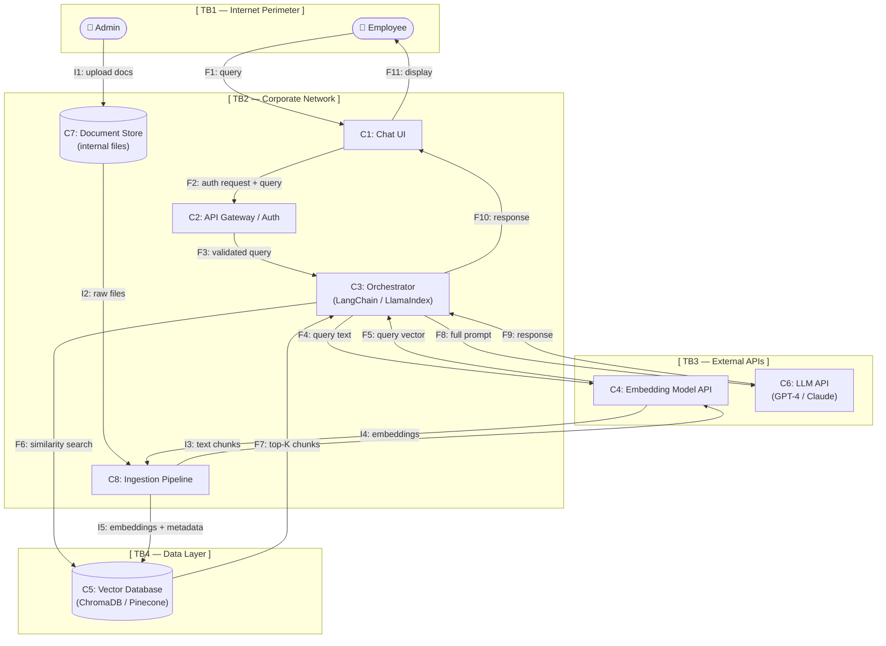

# Data Flow Diagram — RAG-Enabled Corporate AI Assistant
**CYBR 472 | Jose Martinez | Spring 2026**

---

## System Overview

This DFD models a corporate AI assistant that allows employees to query internal company
documents via a chat interface. The system uses a Retrieval-Augmented Generation (RAG)
architecture consisting of two pipelines: a **Query Pipeline** (real-time) and a **Document
Ingestion Pipeline** (batch/on-demand).

---

## Actors

| Actor | Description | Trust Level |
|---|---|---|
| Employee (User) | Internal employee querying the assistant | Untrusted input |
| Admin / Document Owner | HR or IT staff who upload company documents | Partially trusted |
| LLM Provider (External) | Third-party API (e.g., OpenAI, Anthropic) | Untrusted external |

---

## Components

| ID | Component | Description |
|---|---|---|
| C1 | Chat UI | Browser-based interface employees use to type queries |
| C2 | API Gateway / Auth | Validates identity, enforces rate limits, routes requests |
| C3 | Orchestrator | Core logic layer (e.g., LangChain). Manages prompt construction and flow |
| C4 | Embedding Model API | Converts text to vector embeddings (may be internal or external API) |
| C5 | Vector Database | Stores document embeddings; performs similarity search (e.g., ChromaDB, Pinecone) |
| C6 | LLM API | External model that generates the final response (e.g., GPT-4, Claude) |
| C7 | Document Store | Internal file storage holding raw corporate documents (PDFs, DOCX, etc.) |
| C8 | Ingestion Pipeline | Chunking, cleaning, and embedding logic for new documents |

---

## Trust Boundaries

| Boundary | Separates |
|---|---|
| TB1: Internet Perimeter | Employee browser ↔ Chat UI (public-facing) |
| TB2: App / Internal Services | API Gateway ↔ Orchestrator (internal network) |
| TB3: Internal / External API | Orchestrator ↔ LLM API and Embedding Model API (leaves corporate network) |
| TB4: App / Data Layer | Orchestrator ↔ Vector DB and Document Store |

---

## Data Flows — Query Pipeline (Real-Time)

| Flow ID | From | To | Data | Crosses Boundary |
|---|---|---|---|---|
| F1 | Employee | C1 Chat UI | User query (plaintext) | TB1 |
| F2 | C1 Chat UI | C2 API Gateway | Authenticated HTTP request + query | TB1 |
| F3 | C2 API Gateway | C3 Orchestrator | Validated query + user session token | TB2 |
| F4 | C3 Orchestrator | C4 Embedding Model | Query text (for vectorization) | TB3 (if external) |
| F5 | C4 Embedding Model | C3 Orchestrator | Query embedding vector | TB3 (if external) |
| F6 | C3 Orchestrator | C5 Vector DB | Similarity search request (query vector) | TB4 |
| F7 | C5 Vector DB | C3 Orchestrator | Top-K relevant document chunks + metadata | TB4 |
| F8 | C3 Orchestrator | C6 LLM API | Constructed prompt (system prompt + chunks + query) | TB3 |
| F9 | C6 LLM API | C3 Orchestrator | Generated response text | TB3 |
| F10 | C3 Orchestrator | C1 Chat UI | Final response | TB2 |
| F11 | C1 Chat UI | Employee | Displayed answer | TB1 |

---

## Data Flows — Ingestion Pipeline (Batch)

| Flow ID | From | To | Data | Crosses Boundary |
|---|---|---|---|---|
| I1 | Admin | C7 Document Store | Raw documents (PDF, DOCX, etc.) | TB2 |
| I2 | C7 Document Store | C8 Ingestion Pipeline | Raw document files | TB4 |
| I3 | C8 Ingestion Pipeline | C4 Embedding Model | Text chunks | TB3 (if external) |
| I4 | C4 Embedding Model | C8 Ingestion Pipeline | Chunk embeddings | TB3 (if external) |
| I5 | C8 Ingestion Pipeline | C5 Vector DB | Embeddings + chunk metadata (source, page, etc.) | TB4 |

---

## Mermaid Diagram

---

## Notes for Threat Modeling

- **F8 (Orchestrator → LLM API)** is the highest-risk flow: the full prompt including retrieved
  corporate document chunks leaves the corporate network to an external provider.
- **F7 (Vector DB → Orchestrator)** is the injection point for RAG poisoning attacks, if the
  document store is compromised (via I1), malicious content surfaces here.
- **C2 (API Gateway)** is the primary enforcement point for authentication and rate limiting.
- **C3 (Orchestrator)** is the trust hub, it touches every other component and constructs the
  prompt, making it the highest-value target for privilege escalation.
- The **Ingestion Pipeline** (I1–I5) is often overlooked but is the attack surface for data
  poisoning, an attacker who can upload documents controls what the LLM "knows."
